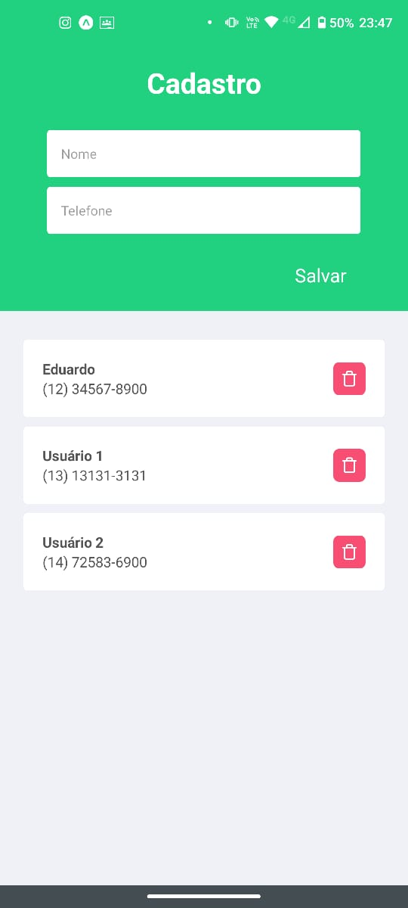

# Atividade 2 da disciplina de Mobile

## Criar uma aplicação mobile com as seguintes características:

- Deve exibir na interface, dois campos de texto para digitar nome e telefone,
  e um botão para salvar.
- Todos os cadastros realizados devem ser exibidos em uma listagem, logo
  abaixo dos campos de texto no formato Nome – Telefone.
- Na listagem, deve existir um botão para excluir o contato selecionado.
- Todos os dados devem ser armazenados no firebase.

# React Native

Projeto criado com React Native e Expo

# Preparando o ambiente

## Dependências

Para iniciar o projeto é necessário instalado em sua máquina o [NodeJS](https://nodejs.org/pt-br/) e o [Expo CLI](https://docs.expo.io/workflow/expo-cli/) nas dependências globais do Node.

- Usando **npm**

```bash
$ npm install
```

- Usando **yarn**

```bash
$ yarn install
```

## Iniciando o servidor

- Usando o próprio **expo**

```bash
$ expo start
```

- Usando **npm**

```bash
$ npm run start
```

- Usando **yarn**

```bash
$ yarn start
```

# Print do Projeto


